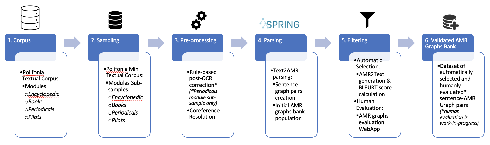
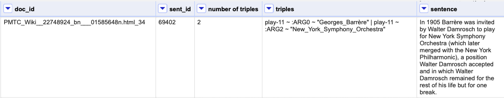

# Polifonia Knowledge Extractor

The Polifonia Knowledge Extractor is software that allows the extraction of knowledge from text.
It uses Abstract Meaning Representation (AMR) to parse sentences into semantic graphs and offers the possibility to search within large AMR graphs banks.

### Pipeline

The pipeline of the Polifonia Knowledge Extractor is depicted in the figure below.

__Step 1 - corpus (input)__.
The model takes as input a textual corpus.
For our work, we used as corpus the **[Polifonia Textual Corpus](https://github.com/polifonia-project/Polifonia-Corpus)** (PTC).

__Step 2 - sampling__.
The large size of the PTC does not allow to easily analyze the results of our methodology for knowledge extraction.
For this reason, we decided to conduct our experiments on a sample of the PTC, the Polifonia Mini Textual Corpus (PMTC). PMTC is downloadable from 

__Step 3 - pre-processing (cleaning)__.
The PTC contains a large portion of historical documents obtained using Optical Character Recognition technologies.
It thus contains errors that must be corrected in order to avoid parsing inaccuracies.
As a first step towards post-OCR correction, we focused on fixing the major errors.
As the input unit to the Text2AMR parsing step, as implemented in our pipeline, is the sentence, we paid specific attention to OCR errors in source texts that impacted sentence cohesion.
We noticed that periodicals' format peculiarities, such as the arrangement of text into two or more columns on a single page, systematically caused incorrect sentence break issues.
Driven by the hypothesis that reconstructing sentence cohesion could enhance the output quality of our Text2AMR parsing step, we decided to implement a minimal rule-based strategy to support the reconstruction of sentence cohesion while preserving source text paragraph breaks. 
This strategy is released and described in **[Post-OCR Correction Rules](https://github.com/polifonia-project/rulebased-postocr-corrector)** repository.
Furthermore, the PTC contains long documents that cannot be parsed as a whole but have to be split into sentences.
This step leads to possible loss of information, especially regarding the use of coreferences.
For this reason, we decided to adopt a coreference resolution module and substitute pronouns with actual names.
As coreference resolution module we adopted **[SpaCy neuralcoref](https://spacy.io/universe/project/neuralcoref)**.
We focused only on nouns and pronouns mentioned in a span of 5 sentences.

__Step 3 - parsing__.
Once the sentences have been cleaned, and pronouns have been replaced with proper names, it is possible to pass them to an AMR parser.
As an AMR parser, we used **[SPRING](https://github.com/SapienzaNLP/spring)** to obtain an initial set of AMR graphs from the sampled and pre-processed corpus.

__Step 4 - filtering__.
Given that we are using non-standard texts (historical documents), the results of the AMR parser may be inaccurate.
For this reason, we decided to use a back-translation approach that converts the generated graphs back to sentences.
We used SPRING for this task.
With the back-translated sentences, we are in a position to compute similarity scores among the original sentences and the generated ones.
This score serves to determine the quality of the AMR graphs.
The rationale behind this is that if, starting from the generated graph, the model can produce a sentence similar enough to the original sentence, this is a signal of the good quality of the graph.
Another strategy to validate the quality of the AMR graphs consists in developing a web application that allows human validators to check the correctness of specific portions of the graphs.

__Step 5 - graph bank__.
The final step of our pipeline consists in obtaining a large set of (presumably) good quality graphs that can be queried and used in other applications such as Knowledge Graph construction and/or Question Answering.

## The graph bank
The filtering procedure allowed us to retain 26 588 sentences from the 125 683 parsed sentences.
We recall that the high number of discarded sentences is due to noise in the input sentences, mainly due to OCR errors.
The filtered AMR graphs bank is downloadable from 

### Statistics

Some statistics of our graph bank can be found in the following table:

| Module | Lang |  #parsed sentence | #triples |
| --- | --- |  --- | --- |
| Encyclopedic | English |  10.015 | 298.369 |
| Books | English |  8.443 | 198.862 |
|Periodicals | English |  6.398 | 109.623 |
|Child (Pilots) | English |  1.227 | 24.049 |
|Meetups (Pilots) | English |  464 | 13.903 |
|MusicBO (Pilots) | English |  41 | 1.297 |
| Overall | English | 26.588 | 646.103 |

## Installation
> git clone https://github.com/polifonia-project/Polifonia-Knowledge-Extractor

> pip install -r requirements.txt
## How to use
The parameters of the model are the following:

--propbank-predicate: it is the **[PropBank](http://propbank.github.io)** predicate to search in the graph bank. It is a required parameter. The complete list of PropBank predicates, together with their description and role set, can be found **[here](https://verbs.colorado.edu/propbank/framesets-english-aliases/)**. 

--save_to_file:This parameter indicates if the results of the search has to saved into a tsv file (located in the **out** folder)

## The results
The results of each search can be saved in a specific file inside the **out** folder.
The filename corresponds to the PropBank predicate used for the search, followed by a **.tsv** extension.
The output file has 5 fields:
1. document id: the ID of the document from which the information has been extracted
2. sentence id: the ID of the sentence from which the information has been extracted
3. number of triples: the number of triples (AMR node name, AMR relation, AMR node name) extracted from the sentence
4. triples: the extracted triples
5. sent: the sentence from which the triples have been extracted

### Example
As an example, we can use the **play-11** PropBank predicate:

> python search.py --propbank_predicate play-11

With this search, 311 sentences are selected,d, and we can easily discover that Antonio_Buonomo plays an instrument that is the clarinet or that Georges Barrère played in the New York Symphony Orchestra.

